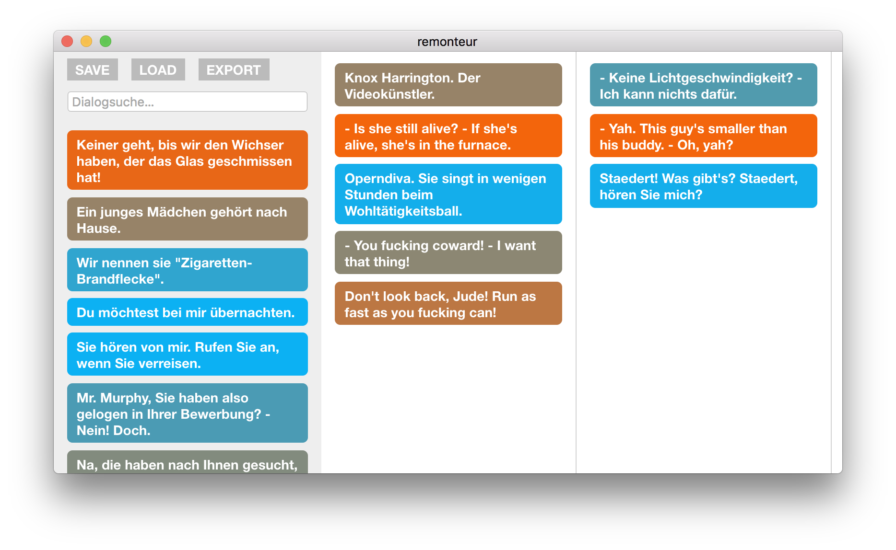

remonteur
========

*Filmemashups per Sprechtext*

Gui-Benutzung
---------
Ziehe die remonteur-App in den Ordner mit dem ``filme/``-Baum (siehe unten) und doppelklicke, um zu beginnen.

Zum Bearbeiten der exportierten ``fcpxml``-Dateien eignen sich:
 
- Final Cut Pro
- daVinci Resolve

Filme auf Mac einlesen
------------

### Benötigte Kommandozeilen-Tools installieren

*Homebrew* kann das schnell und einfach erledigen (MacOs-Paketmanager). [Auf der Website](https://brew.sh) steht alles Notwendige zur Installation. Sobald diese abgeschlossen ist:

1. Installiere Python und ffmpeg mit
    - ``$ brew install python2 ffmpeg``

2. *Nur für Liebhaber*: Erstellen einer [virtuellen Umgebung](https://virtualenv.pypa.io/) per
    - ``$ virtualenv -p `which python2` env ``
    - ``$ source env/bin/activate``
    

2. Installiere alles benötigten Python-Module in einem Rutsch mit:
    - ``$ pip2 install -r requirements.txt``

    
### Filme sammeln
Das Tool erwartet einen Ordner, in welchem für jeden Film ein Unterordner existiert. Darin befinden sich der Film selbst (.mkv, .mp4 oder .avi) und - falls bereits vorhanden - eine Untertitel-Datei.

- remonteur (GUI, für Verarbeitung nicht benötigt)
- filme/
   - Pocahontas/ 
     - pocahontas.mkv
     - pocahontas.srt
     - *snippets/* (Dialogfetzen, wird vom Tool erzeugt)
   - Der König der Löwen/
     - lionking.avi
     - lionkingDe.srt
     - *snippets/*

   - *lines.db* (Datenbank, wird vom Tool erstellt)

### Filme verarbeiten
``./rescan.py <Filme-Verzeichnis>``

- Setzt automatisch fort, wenn unterbrochen wird
- ``./check.py`` zeigt den Zustand der Datenbank an

Entwickeln
==========

(TODO)

Das Gui ist eine electron-Applikation. 

``cd filmton``

``npm install``

``npm run dist``erzeugt app